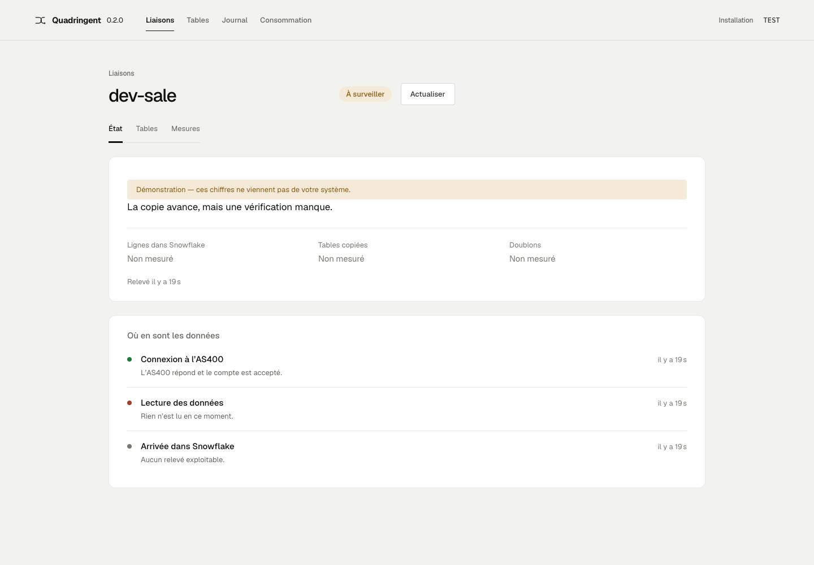

# Quadringent

Quadringent copie les changements d’un IBM i vers Snowflake et montre les
preuves de progression : lecture du journal, dépôt brut, chargement et
rapprochement. Il s’adresse aux équipes data qui exploitent leurs propres
infrastructures IBM i, AWS et Snowflake.

Une capture en cours ne garantit pas que la destination soit à jour. Le cockpit
distingue ces états et conserve « Non mesuré » quand une preuve manque.



**Édition communautaire, version 0.2.4 — préversion DEV.** Le moteur, l’API
et le cockpit local sont open source sous [Apache-2.0](LICENSE), utilisables
sans clé de licence ni limite commerciale de tables. L’exploitant assume les
coûts de son infrastructure. Aucune qualification PROD n’est annoncée.

Les contributions suivent la même licence. Des services ou des extensions
avancées distinctes pourront être payants à l’avenir ; les droits accordés sur
les versions publiées restent acquis. Voir le [modèle du projet](docs/licensing.md)
et les [avis des dépendances](THIRD_PARTY_NOTICES.md).

## Essayer le cockpit localement

Depuis un clone du dépôt, avec Python 3.12+ et Node 24 ou 26 :

```sh
python3 -m venv .venv
.venv/bin/python -m pip install .
npm ci --prefix ui
npm run build --prefix ui
sh scripts/start_local.sh
```

Ouvrir <http://127.0.0.1:8844>. Le cockpit est vide au premier démarrage.
La configuration `examples/local.env` est fictive ; ces commandes ne contactent
ni IBM i, ni AWS, ni Snowflake. Une liaison créée dans Installation est enregistrée
localement, **déclarée, pas encore en service**. Le répertoire `.local-state/`
conserve les déclarations après un redémarrage.

Pour connecter de vrais systèmes, suivre le [guide d’installation](docs/product/install-client.md).
Il distingue prérequis, déclaration et preuve de réplication. Le parcours
IBM i → GCS → Snowflake a été vérifié sur GKE DEV avec des tables
synthétiques. EKS DEV, VM AWS DEV et VM GCP DEV ont été réellement installés,
puis arrêtés ou supprimés après les essais ; la réplication IBM i → Snowflake
n'y a pas encore été vérifiée sur EKS ou VM. Depuis l'acquittement IBM i, les délais
observés jusqu'au miroir sur GKE varient de 6,35 à 31,31 s : aucun maximum
de 10 s n'est annoncé.

## Périmètre

- Lecture Java/JTOpen sur TLS, dépôt brut S3 et checkpoint durable.
- Capture et rapprochement vers Snowflake, preuves datées et périmètre explicite.
- Cockpit desktop (référence 1440 px), API `/v1`, déclaration de liaisons.
- Actions selon capacités disponibles, confirmation et journal d’audit.
- Crédits Snowflake sur 24 h, arrêtées au moins 6 h avant le relevé ; conversion
  au prix déclaré du site.
- S3 Standard : volume CloudWatch et estimation mensuelle à volume constant au
  tarif public AWS relevé. OpenCost : allocation au namespace Quadringent,
  total du cluster et inutilisé en contexte. Collecte facultative, hors facture.

Le runtime autorise `dev`, `int`, `test`, `staging`. La chart exige un namespace égal à `site.namespace` et interdit toute promotion
PROD ; l’exemple utilise `dev` et `quadringent-demo`. Le cockpit utilise le loopback **sans authentification par défaut** :
lire la [sécurité](SECURITY.md) avant d’exposer l’accès ou de donner des droits d’action.

## Documentation

- [Présentation statique](site/index.html) : servir avec
  `python3 -m http.server 8860 --bind 127.0.0.1`, puis ouvrir `/site/`.
- [Architecture](docs/architecture.md), [API](docs/api.md), [FinOps](docs/finops.md).
- [Exploitation et reprise](docs/operations.md), [sécurité](SECURITY.md).
- [Qualifier les pods natifs et la reprise](docs/product/native-qualification.md) :
  images admises, identités cloud, rapprochement source/destination et mesures
  de latence avec preuves privées.
- [Contribuer et tester](CONTRIBUTING.md), [changements](CHANGELOG.md),
  [versions et livraison](docs/releasing.md).

Le lanceur Python unique est `python -m pytest -q`, après
`python -m pip install -e '.[dev,api]'`. Les tests Java et UI sont documentés dans
CONTRIBUTING. Les expériences dans `research/` sont exclues du wheel produit.
