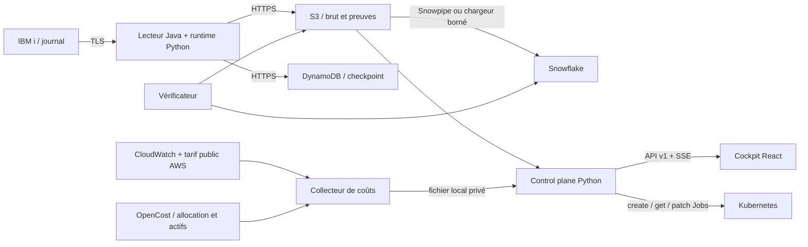

# Architecture

Le lecteur Java relève le journal IBM i sur TLS. Le runtime Python contrôle
les fenêtres, publie le brut sur S3 puis avance le checkpoint DynamoDB selon
le contrat de capture. Les chargeurs et sondes Snowflake apportent des preuves
distinctes du seul succès de lecture.

La phase métier et `run.state` ne se remplacent pas. Une table historique peut
subsister après l’arrêt du lecteur. Une absence de preuve ne devient jamais zéro.

| Répertoire | Responsabilité |
|---|---|
| `src/quadringent/` | Capture, checkpoint, chargeurs, mesures et contrats |
| `src/quadringent_control_plane/` | API, projection, capacités, intentions et audit |
| `java/` | Lecteur et sondes JDBC/JTOpen |
| `ui/` | Cockpit ; textes métier dans `domain/operator.ts` |
| `chart/`, `docker/` | Déploiement borné et images à surface réduite |
| `infra-values/` | Exemples synthétiques à adapter dans un dépôt privé de site |
| `research/` | Comparaisons et captures expérimentales, hors wheel produit |
| `tests/` | Garanties produit et outillage, toutes collectées par pytest |
| `site/`, `docs/` | Présentation et documentation |

Les générateurs de rapports figés, manifests expérimentaux et rapports privés
sont exclus. Le dépôt privé original les conserve. AGENTS.md porte uniquement
les règles utiles aux contributions.

`SiteConfig` valide le périmètre d’un site. Le registre multi-site utilise
`contextvars` pour isoler un contexte explicitement sélectionné. Le serveur CLI
sert le site déclaré par son environnement ; enregistrer plusieurs déclarations
ne provisionne pas automatiquement des runtimes multi-sites.

La collecte de coûts reste indépendante de la capture. Le control plane ne reçoit
aucun droit de facturation : il projette un relevé local daté et lié au site,
bucket, région et namespace déclarés. Une panne de coût ne change pas l’état de
capture ; une panne d’une des deux sources ne masque pas l’autre. Voir [FinOps](finops.md).
